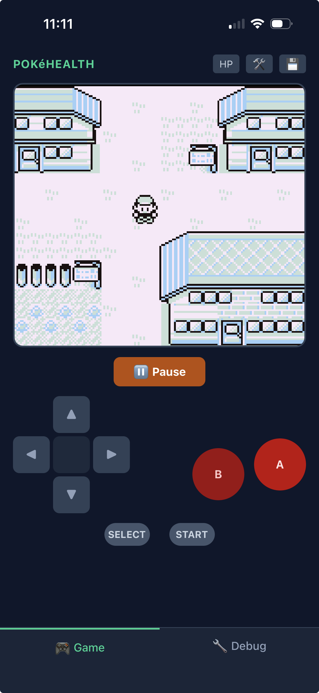
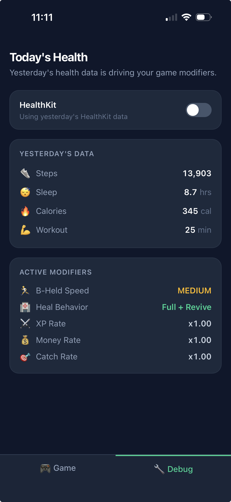

# PokéHealth


A mashup of Pokémon Red and Apple HealthKit. What you did yesterday affects how the game plays today.

Your steps, sleep, calories burned, and workout minutes from the previous day feed into the game as modifiers. Walked 15k steps? Your character sprints across Kanto. Slept well? Pokémon Centers fully heal your team. Had a good workout? You earn more money, catch Pokémon more easily, and gain XP faster. Stayed on the couch? The game quietly pushes back.

It runs entirely in the browser as a PWA — a [patched Pokémon Red ROM](https://github.com/pret/pokered) inside a [Game Boy emulator](https://github.com/binji/binjgb) compiled to WebAssembly, with health data pulled from HealthKit via [pwa-kit](https://github.com/eddmann/pwa-kit). No server. No account. Everything local.

<p align="center">
  
  
  
</p>

## How it works

Each day, your health stats map to gameplay modifiers — movement speed, healing quality, XP rate, money earned, and catch rate. The game reads these on every frame and adjusts accordingly. You can inspect your active modifiers from the in-game START → HEALTH menu.

See [**docs/modifiers.md**](docs/modifiers.md) for the full tier tables, and [**docs/architecture.md**](docs/architecture.md) for the technical deep dive into ROM patching, the hook protocol, and emulator integration.

## Setup

### Prerequisites

- [Bun](https://bun.sh) — runtime and package manager
- [rgbds](https://rgbds.gbdev.io) — Game Boy assembler/linker (`brew install rgbds` on macOS)
- [Emscripten](https://emscripten.org/docs/getting_started/downloads.html) — WASM compiler (emsdk)

> **Note:** Emscripten must be on your `PATH`. If you installed via emsdk, run `source <emsdk-dir>/emsdk_env.sh` first (or add it to your shell profile).

### Getting started

```bash
# 1. Clone with submodules (pokered + binjgb)
git clone --recursive <repo-url>
cd pokehealth

# 2. Install JS dependencies
bun install

# 3. Build the binjgb WASM emulator (~60s first time, ~2s incremental)
bun run emu:build

# 4. Build the patched Pokémon Red ROM (~30s first time, ~5s incremental)
bun run rom:build

# 5. Start the dev server
bun run dev
```

Open `http://localhost:5173`. The game auto-boots into Red's room. Use the Debug tab to set health values and Apply them to the running game. Open the in-game START → HEALTH menu to verify.

> **Already cloned without `--recursive`?** Run `git submodule update --init --recursive` to fetch the submodules.

### Deploy

```bash
bun run ship    # build everything + deploy to Cloudflare Workers
```

### iOS app

The native iOS wrapper is built with [pwa-kit](https://github.com/eddmann/pwa-kit), which provides the HealthKit bridge. To configure a fresh clone:

```bash
npx @pwa-kit/cli init ios --url "https://pokehealth.eddmann.workers.dev/" --features "healthkit"
```

Then open the generated Xcode project in `ios/`, and build to a device or simulator.

## Disclaimer

This project does not distribute any Nintendo-copyrighted content. The Pokémon Red ROM is built locally from the [pret/pokered](https://github.com/pret/pokered) disassembly — you must build it yourself with `bun run rom:build`. Pokémon is a trademark of Nintendo / Game Freak / Creatures Inc. This is a fan project with no commercial intent.

The [binjgb](https://github.com/binji/binjgb) emulator is used under the MIT License.

## Project structure

```
pokehealth/
├── rom/
│   ├── pokered/              # git submodule (pret/pokered, unmodified)
│   └── patches/
│       ├── apply.sh          # Patch application script
│       └── health_menu.asm   # In-game HEALTH screen (assembly)
├── emulator/
│   └── binjgb/               # git submodule (binji/binjgb)
├── scripts/
│   ├── build-rom.sh          # Patch + build ROM → public/roms/
│   └── build-emu.sh          # Build binjgb WASM → public/wasm/
├── src/
│   ├── lib/                  # Emulator wrapper, hooks, health tiers, DB, cheats
│   ├── stores/               # React context for health state
│   ├── hooks/                # useEmulator, useHealthKit
│   └── components/           # GameScreen, DebugScreen, TouchControls, SaveLoad, Nav
└── docs/
    ├── modifiers.md          # Health inputs and gameplay modifier tier tables
    └── architecture.md       # ROM patching, hook protocol, emulator, PWA details
```
